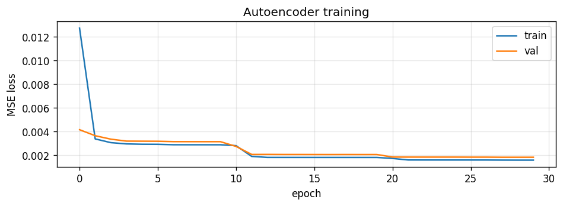
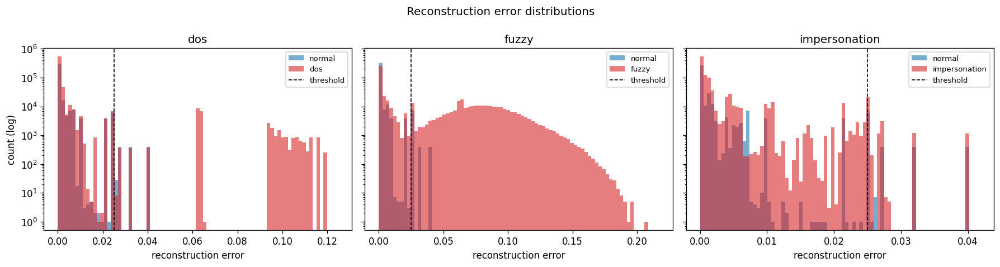
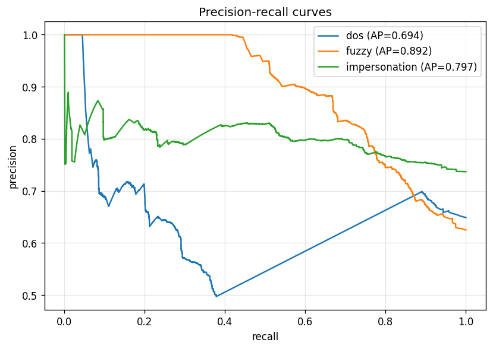
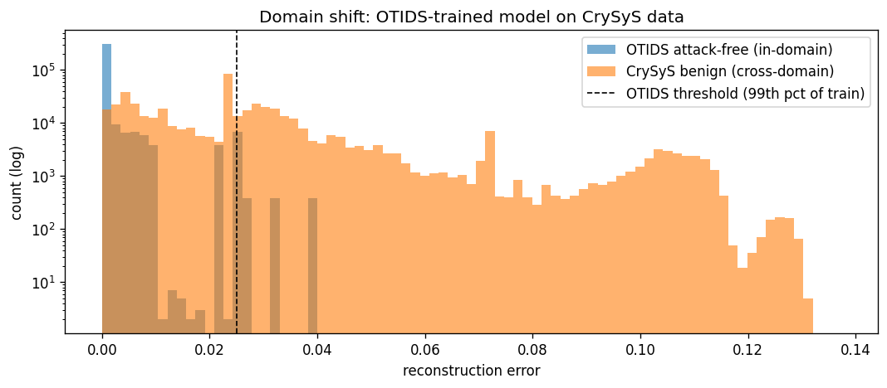
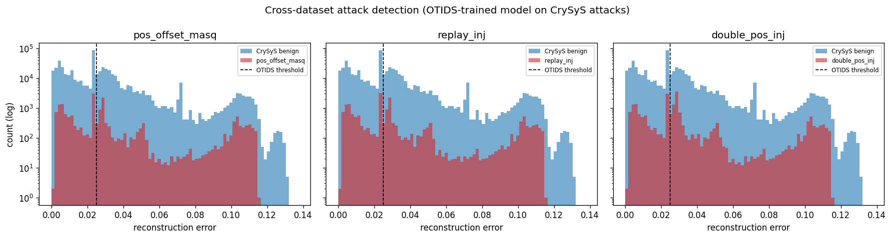

# CAN Bus Anomaly Detection with an MLP Autoencoder

> Unsupervised intrusion detection on automotive in-vehicle network traffic. A PyTorch MLP autoencoder is trained on the OTIDS benchmark (Kia Soul, ~4.5 million CAN frames) and reaches **PR-AUC of 0.69 / 0.89 / 0.80** on DoS / Fuzzy / Impersonation attacks. A cross-dataset evaluation on the CrySyS benchmark (different vehicle, different ECUs) then demonstrates severe domain shift, with diagnosis and proposed remediations.

---

## TL;DR

A portfolio project that takes a real automotive cybersecurity problem end-to-end:

1. **Data understanding** — parse 200 MB of raw CAN bus log files, document quirks, decide preprocessing rules.
2. **Modeling** — design and train a small MLP autoencoder, with the standard PyTorch training loop written from scratch.
3. **Honest evaluation** — favor PR-AUC over F1 because labels in OTIDS are file-level, not per-frame. Choose the threshold using only training data so the test set stays clean.
4. **Hyperparameter sweep** with documented intuition (`results/iteration_log.md`) — three full-data runs plus a smoke baseline, with mechanism-level reasoning per result.
5. **Cross-dataset evaluation** on CrySyS — same architecture, different vehicle — exposing where single-dataset training breaks down.

This is **not** a state-of-the-art benchmark or a production intrusion detection system. It is a portfolio-ready demonstration of the *engineering discipline* needed to take a CAN bus anomaly-detection idea from raw data to defensible numbers.

---

## 0. Glossary
### Automotive networking

| Term | Meaning |
|---|---|
| **CAN bus** (Controller Area Network) | The dominant in-vehicle communication standard since the 1990s. A shared serial broadcast bus connecting all the microcontrollers in a car. Designed for reliability and low latency, **not** for security — frames are unauthenticated and any node can transmit anything. |
| **CAN frame** | One message on the bus. Contains a **CAN ID** (11 bits), a **DLC**, 0–8 **data bytes**, and a timestamp. |
| **ECU** (Electronic Control Unit) | A microcontroller running in the vehicle — engine ECU, brake ECU, ABS ECU, infotainment ECU, etc. Modern cars have 50–150 of them. Each one transmits messages with its own characteristic CAN IDs. |
| **CAN ID** | The 11-bit identifier on each frame that says "what kind of message this is" (engine RPM, wheel speed, etc.). Lower CAN IDs have higher bus priority. |
| **DLC** (Data Length Code) | Number of data bytes in the frame, 0 to 8. The rest of the byte slots are unused. |
| **OEM** (Original Equipment Manufacturer) | The vehicle maker — BMW, VW, Toyota, etc. Each OEM uses its own CAN ID mapping, so traffic from a Kia and a VW look entirely different on the wire. |
| **SocketCAN / candump** | Linux's standard CAN driver and its log file format. The format is `(timestamp) interface can_id#data_bytes`. CrySyS uses this; OTIDS does not. |

### Cybersecurity / attacks

| Term | Meaning |
|---|---|
| **IDS** (Intrusion Detection System) | A system that watches network traffic and flags potential attacks. *Network-based* IDS watches packet flow; *host-based* watches a single device. This project builds a CAN-bus-network IDS. |
| **DoS attack** (Denial of Service) | Flood the bus with high-priority messages (typically CAN ID `0x000` since it has the lowest numeric value and thus highest priority). Legitimate ECUs lose airtime. |
| **Fuzzy attack** | Inject random CAN IDs with random data bytes. The point is usually reconnaissance: figure out which IDs/data trigger which behaviors. |
| **Impersonation attack** / **Masquerade attack** | Inject messages that look like they came from a legitimate ECU — same CAN ID, but with spoofed data values to manipulate vehicle behavior. The hardest attack to detect because the message looks normal except for the data. |
| **Fabrication attack** | Inject *new* malicious frames into the bus (DoS, fuzzy, and one form of impersonation are fabrication attacks). |
| **Spoofing** | Impersonating another node by sending its messages. Same idea as impersonation/masquerade. |

### Machine learning / deep learning

| Term | Meaning |
|---|---|
| **Autoencoder** | A neural network with two halves — an encoder that compresses the input into a low-dimensional representation, and a decoder that reconstructs the input from that representation. Trained to reproduce its inputs. The compression forces the model to learn the *structure* of normal data. **For anomaly detection:** train on normal data, then a high reconstruction error on new data signals an anomaly. |
| **MLP** (Multi-Layer Perceptron) | The simplest kind of neural network: stacked fully-connected (Linear) layers separated by nonlinear activations. No convolutions, no recurrence. |
| **LSTM** (Long Short-Term Memory) | A type of recurrent neural network that processes sequences and remembers context across timesteps. Used when the temporal pattern matters — not used in this project, but suggested as the next step. |
| **Bottleneck** | The smallest layer in an autoencoder. All information must pass through it, forcing compression. |
| **MSE** (Mean Squared Error) | A loss function: average of `(prediction − target)²` over all features. Used here because the autoencoder's output is a continuous-valued vector. |
| **Reconstruction error** | The MSE between the autoencoder's input and its output. Small = the model "recognized" the input. Large = it didn't. |
| **Threshold** | The reconstruction-error value above which a frame is flagged as anomalous. Picked at the 99th percentile of training error in this project. |
| **PR-AUC** (Precision-Recall Area Under Curve) | A single-number summary of detection quality that is *threshold-independent*. Computed by sweeping the threshold across all values and integrating precision × recall. Range `[0, 1]`; higher is better. **The honest metric for unsupervised anomaly detection** with imbalanced or coarsely-labeled data. |
| **Precision** | Of frames the model *flagged* as anomalous, what fraction were actually anomalies? `TP / (TP + FP)`. High precision = few false alarms. |
| **Recall** | Of frames that *were* anomalies, what fraction did the model flag? `TP / (TP + FN)`. High recall = few missed attacks. |
| **F1 score** | Harmonic mean of precision and recall. Only high when *both* are high. Can be misleading when labels are coarse or the threshold is wrong — which is exactly our situation, hence why we report PR-AUC instead. |
| **Confusion matrix** | A 2×2 table of (model said positive, model said negative) × (actually positive, actually negative). All four metrics above derive from it. |
| **One-hot encoding** | Convert a categorical value (like a CAN ID) into a vector with a `1` in one position and `0`s elsewhere. Lets a neural network treat each category as a separate feature. |
| **Sigmoid** / **ReLU** | Activation functions. **Sigmoid** squashes any input into `[0, 1]`. **ReLU** (Rectified Linear Unit) passes positive values unchanged and zeroes out negatives. |
| **Adam** | The most common optimizer for training neural networks; adapts the learning rate per parameter. We use it. |
| **Train / val / test split** | The three subsets your data is split into. **Train**: weights are updated using these. **Val**: model is evaluated on these during training (for early stopping); weights *don't* update. **Test**: held out entirely until final evaluation, to give honest numbers. |
| **Early stopping** | Stop training when the validation loss stops improving. Prevents overfitting. |
| **Overfitting** | When the model memorizes training data and fails on new data. Train loss keeps dropping while val loss starts rising. |
| **Data leakage** | When information from the test set accidentally influences training (e.g., normalizing using statistics computed across the whole dataset). Inflates reported numbers; model fails in production. |
| **Domain shift** | When the training data and the deployment data come from different distributions. The cross-dataset evaluation is exactly this — train on Kia, deploy on a different vehicle. |
| **Embedding** | A learned low-dimensional vector representation of a categorical thing. An alternative to one-hot encoding that can transfer across datasets. |
| **autograd** | PyTorch's automatic differentiation engine. Records every operation you perform on tensors so it can compute gradients with `loss.backward()`. |
| **`nn.Module`** | The base class for any PyTorch model or layer. You subclass it, define your layers in `__init__`, and the forward pass in `forward()`. |
| **DataLoader** | A PyTorch utility that batches and shuffles data from a Dataset. |
| **BPTT** (Back-Propagation Through Time) | Backpropagation as applied to a recurrent network like an LSTM. Not used here but mentioned in the "next steps" section. |

### Datasets and labs

| Term | Meaning |
|---|---|
| **OTIDS** | The CAN intrusion dataset from HCRL (Hacking and Countermeasures Research Lab) at Korea University. Recorded from a Kia Soul. The de facto introductory benchmark for CAN bus IDS research. |
| **CrySyS** | The CAN traffic dataset from CrySyS Lab (Budapest University of Technology and Economics, Hungary), published in *Nature Scientific Data* 2023. Used here as a cross-dataset domain shift test. |
| **HCRL** | Hacking and Countermeasures Research Lab. The Korean group that published OTIDS. |
| **Figshare** | A public scientific data repository where CrySyS hosts its dataset. |

### Engineering / standards

| Term | Meaning |
|---|---|
| **ISO 26262** | The functional safety standard for automotive electronics. Defines how to systematically reduce risk in safety-critical features. |
| **ASIL** (Automotive Safety Integrity Level) | Risk classification in ISO 26262 — ASIL D is highest safety integrity, ASIL A is lowest. Used to drive design and verification rigor. |
| **ADAS** (Advanced Driver-Assistance Systems) | Features like lane-keeping, adaptive cruise, automatic emergency braking. The career-relevant context for this project. |

---

## 1. Problem

The Controller Area Network bus has been the dominant in-vehicle communication standard since the early 1990s. It was designed for low cost, low latency, and fault tolerance — **not** security. Every CAN frame is broadcast to every node, frames are unauthenticated, and any compromised ECU can spoof messages from any other ECU.

In practice this enables three classes of attack against modern vehicles:

- **Denial of Service (DoS)**: a malicious node floods the bus with high-priority frames (typically CAN ID `0x000`, which wins all arbitration), causing legitimate ECUs to lose airtime. Practical impact: dashboard freezes, throttle/brake commands missed.
- **Fuzzy attacks**: random CAN IDs with random data bytes are injected. Used for reconnaissance — find out which messages produce which behaviors.
- **Impersonation / masquerade**: a compromised ECU emits messages that look like they came from another legitimate ECU, with subtly-spoofed data values. The hardest attack to detect because the message looks normal except for the data values, and the receiving ECUs trust whatever is on the bus.

A **supervised** intrusion detector — train a classifier on labeled attack examples — doesn't generalize to novel attack patterns. **Unsupervised** anomaly detection with autoencoders sidesteps this: train the model on *normal* traffic only, then flag any frame that the model fails to reconstruct.

This project implements the simplest credible version of that idea, evaluates it honestly, and tests its limits.

---

## 2. Dataset

### Primary: OTIDS

| Property | Value |
|---|---|
| Source | [OTIDS — CAN Intrusion Dataset (HCRL, Korea University)](https://ocslab.hksecurity.net/Dataset/CAN-intrusion-dataset) |
| Vehicle | Kia Soul |
| `Attack_free_dataset.txt` | 200 MB, ~4.5M frames, normal driving |
| `DoS_attack_dataset.txt` | 56 MB, normal traffic with `0x000` injections |
| `Fuzzy_attack_dataset.txt` | 51 MB, normal traffic with random IDs / data |
| `Impersonation_attack_dataset.txt` | 84 MB, normal traffic with spoofed legitimate IDs |

**Line format** (whitespace-separated with inline label words):

```
Timestamp: 0.000000   ID: 0316   000   DLC: 8   05 20 ea 0a 20 1a 00 7f
```

**Labeling caveat.** OTIDS attack files contain a *mix* of legitimate and injected frames, but the only label available is the *file name* (this whole file was recorded during a DoS attack scenario). There is no per-frame attack label. This makes the F1 score misleading and PR-AUC the honest metric — explained in Results.

### Cross-dataset: CrySyS

| Property | Value |
|---|---|
| Source | [CrySyS Lab](https://www.crysys.hu/research/vehicle-security) (Budapest University of Technology and Economics). Published in [*Nature Scientific Data*, 2023](https://www.nature.com/articles/s41597-023-02716-9). |
| Format | SocketCAN candump: `(<timestamp>) can0 <can_id>#<hex_data_bytes>` |
| Size | 26 scenario recordings, ~12 GB extracted, ~2.5 hours of benign traffic plus attack variants |

Used here as the out-of-distribution test for cross-vehicle generalization.

### How to download

OTIDS: auto-downloaded inside [`notebooks/project/01_explore_otids.ipynb`](notebooks/project/01_explore_otids.ipynb).
CrySyS: one-shot manual download — see [`notebooks/project/03_crysys_cross_dataset.ipynb`](notebooks/project/03_crysys_cross_dataset.ipynb) for the Figshare link. Both end up under `data/` (which is gitignored — datasets are never committed).

---

## 3. Approach

### Feature engineering

Each CAN frame is converted to a 40-dimensional feature vector:

| Slice | Dimensions | Encoding | Why this choice |
|---|---:|---|---|
| Top-30 CAN IDs (one-hot) | 30 | learned from training set | Tells the model "which kind of ECU message is this?" |
| "Other" bucket | 1 | catch-all 0/1 flag | Catches rare or novel IDs |
| Data bytes 0–7 | 8 | `byte / 255` | Hardware-defined range (0–255 per byte) → fixed min-max scaling, no fitting |
| DLC | 1 | `dlc / 8` | Spec range (0–8) → fixed scaling |

**Discipline note.** The top-30 CAN ID list is learned from the *training* split only. The val, test, and CrySyS splits are transformed using those learned IDs without modification. This is the canonical scikit-learn `fit`/`transform` pattern and prevents *data leakage*. See [`src/data/preprocess.py`](src/data/preprocess.py) for the `FeatureBuilder` class.

### Model

```
Input  (40)  →  Linear(40, 16)  →  ReLU
              →  Linear(16,  8)  →  ReLU       [bottleneck — 8 dim]
              →  Linear( 8, 16)  →  ReLU
              →  Linear(16, 40)  →  Sigmoid     [output bounded to [0, 1]]
```

About 1,400 parameters total. The sigmoid output bounds reconstructions to `[0, 1]`, which is the same range our features are normalized to — so MSE loss is well-defined. See [`src/models/autoencoder.py`](src/models/autoencoder.py).

### Training

| Hyperparameter | Value | Justification |
|---|---|---|
| Loss | MSE | Input and target are the same continuous-valued vector (autoencoder objective) |
| Optimizer | Adam, learning rate = 1e-3 | "Just works" baseline for most problems |
| Batch size | 256 | Standard for tabular data on a consumer GPU |
| Epochs | up to 30 with early stopping (patience = 5) | Converges within 15-25 epochs in practice |
| Train / val / test split | 70 / 15 / 15 (chronological) | Chronological because CAN data is sequential; random shuffling would leak timestamps across splits |

### Threshold selection

The detection threshold is set at the **99th percentile of training reconstruction error**. We use *train* errors (not val) so val stays clean for early stopping and test stays clean for reporting. The 99th percentile is conservative — we'd rather have high precision than high recall, since false brakes are dangerous (the ADAS context).

Threshold-independent ranking quality is reported separately as PR-AUC.

---

## 4. Results

### OTIDS (in-domain, full data, winning config: top_k=30, bottleneck=8)

| Attack | Precision | Recall | F1 | **PR-AUC** |
|---|---:|---:|---:|---:|
| DoS | 0.944 | 0.047 | 0.090 | **0.694** |
| Fuzzy | 0.993 | 0.446 | 0.615 | **0.892** |
| Impersonation | 0.856 | 0.011 | 0.022 | **0.797** |

False-positive rate on held-out attack-free test split: **0.52%**.

**Why F1 looks low despite strong PR-AUC.** Each "attack file" in OTIDS contains a mix of legitimate driving frames and injected attack frames, but the only ground-truth label is the *file name* (no per-frame label). The 99th-percentile threshold flags the most-anomalous frames with very high precision (every frame above the threshold really is anomalous — precision > 0.85 across the board), but most frames in each attack file are legitimate driving that the model correctly does *not* flag — which pulls recall (and therefore F1) down. **PR-AUC measures the model's ability to rank attack frames above benign frames regardless of threshold, and that is the honest metric here.**

Plots:
- Training loss: 
- Reconstruction-error histograms (one per attack): 
- Precision-recall curves: 

### Cross-dataset evaluation (same model but on CrySyS data)

| Metric | OTIDS in-domain | CrySyS cross-domain | Change |
|---|---:|---:|---:|
| Benign false-positive rate | 0.52% | **43.6%** | ~80× worse |
| Mean attack PR-AUC across three attack types | ~0.79 | **~0.05** | collapses to ~random |

**Why this happens.** Only 1 of the 18 CAN IDs in CrySyS overlaps with the OTIDS top-30 (because the vehicles use different ECUs with different message catalogs). So **99.8% of CrySyS frames fall into the OTIDS-learned "other" bucket** — and the OTIDS-trained autoencoder rarely saw "other"-bucket frames during training, so it can't reconstruct them well. The model marks both benign CrySyS frames and CrySyS attack frames as anomalous indiscriminately.

**The root cause is the feature pipeline, not the model.** A different vehicle has different ECU IDs, and our one-hot encoding doesn't transfer. Proposed remediations:

1. **Refit the FeatureBuilder on target-vehicle data.** Cheap; doesn't solve the underlying problem but reduces the surface symptom.
2. **Train on multiple vehicles jointly.** Multi-domain training. The model learns vehicle-invariant features.
3. **Replace one-hot encoding with learned CAN-ID embeddings**, trained jointly across datasets. Embeddings generalize across vehicles in ways that one-hots cannot.

See [`notebooks/project/03_crysys_cross_dataset.ipynb`](notebooks/project/03_crysys_cross_dataset.ipynb) for the full analysis. Plots:
- Domain shift histogram: 
- Cross-dataset attack histograms: 

### Hyperparameter study

Three full-data runs plus the smoke baseline. Fully written up at [`results/iteration_log.md`](results/iteration_log.md). Headline findings:

- **Wider top-K (20 → 30) helped consistently**, biggest gain on Impersonation (+0.030 PR-AUC). Reason: impersonation attacks use *legitimate* CAN IDs; giving those IDs explicit feature columns lets the model say "the data bytes for *this specific* ID look wrong."
- **Tighter bottleneck (8 → 4) hurt across all three attacks.** Over-compression raises the noise floor of normal reconstruction without proportionally raising the anomaly signal. The U-shape of autoencoder capacity is real.
- **The smoke run (LIMIT=200,000 rows) beat all full-data runs on PR-AUC.** Mechanism: a narrow chronological training slice produces a *narrow* "normal" distribution → bigger gap to anomalies → higher PR-AUC on biased OTIDS labels. The full-data model is the honest one for deployment. *Lesson: in unsupervised AD, more data improves modeling but can compress the anomaly-detection signal.*

Side-by-side visualization: [`notebooks/project/04_hyperparameter_comparison.ipynb`](notebooks/project/04_hyperparameter_comparison.ipynb).

---

## 5. Reproduce

### Setup

```bash
git clone https://github.com/vatsalparikh96/can-bus-anomaly-detection.git
cd can-bus-anomaly-detection
uv sync                       # core deps + PyTorch (CUDA 11.8)
uv sync --extra dev           # add pytest
uv sync --extra notebook      # add Jupyter
```

`uv` will install the CUDA 11.8 PyTorch wheel automatically (per `[tool.uv.sources]` in `pyproject.toml`). CPU-only is fine for everything except training on the full dataset; the smoke run below works on any machine.

If you don't have `uv`: `pip install uv` then re-run, or install from `pyproject.toml` directly with `pip install -e .`.

### Download data

OTIDS: open [`notebooks/project/01_explore_otids.ipynb`](notebooks/project/01_explore_otids.ipynb) and run the data download cell. End state: 4 files in `data/otids/raw/`.

CrySyS: one-shot 2.85 GB ZIP from Figshare — see the link inside [`notebooks/project/03_crysys_cross_dataset.ipynb`](notebooks/project/03_crysys_cross_dataset.ipynb). Extract under `data/crysys/logs/`.

### Train and evaluate

Full-data training (~10 minutes on a consumer GPU like a GTX 1650):

```bash
uv run python scripts/train.py --out-dir results/runs/new_run --top-k 30 --epochs 30
uv run python scripts/evaluate.py --out-dir results/runs/new_run
```

Fast smoke run (~2 minutes total):

```bash
uv run python scripts/train.py --limit 200000 --epochs 10 --out-dir results/runs/smoke
uv run python scripts/evaluate.py --out-dir results/runs/smoke
```

### Tests

```bash
uv run pytest        # 13 tests, runs in ~25 seconds
```

---

## 6. Repository layout

```
can-bus-anomaly-detection/
├── README.md                       # this file
├── LICENSE                         # MIT
├── pyproject.toml                  # project metadata, dependencies, pytest config
├── uv.lock                         # exact dependency versions (uv-managed)
├── .gitignore                      # excludes data/, .venv/, *.pt, *.npy, *.npz
├── configs/
│   └── default.yaml                # training hyperparameters
├── data/                           # gitignored — datasets live here
├── notebooks/
│   └── project/                    # the four analytical notebooks behind this README
│       ├── 01_explore_otids.ipynb                # OTIDS dataset deep-dive
│       ├── 02_autoencoder.ipynb                  # MLP autoencoder prototype
│       ├── 03_crysys_cross_dataset.ipynb         # cross-dataset domain shift study
│       ├── 04_hyperparameter_comparison.ipynb    # hyperparameter sweep analysis
│       └── _build_*.py             # Python source-of-truth that generates each .ipynb
├── src/
│   ├── data/
│   │   ├── load.py                 # OTIDS log parser
│   │   ├── load_crysys.py          # CrySyS (candump) log parser
│   │   ├── preprocess.py           # FeatureBuilder (fit/transform/save/load)
│   │   └── dataset.py              # CANFrameDataset (PyTorch Dataset wrapper)
│   ├── models/
│   │   └── autoencoder.py          # MLPAutoencoder
│   ├── training/
│   │   ├── train.py                # training loop with early stopping
│   │   └── evaluate.py             # reconstruction-error / threshold / metric helpers
│   └── utils/
│       └── plot.py                 # plot_loss_curves, plot_recon_error_hist, plot_pr_curves
├── scripts/
│   ├── train.py                    # CLI entry: train + save artifacts
│   └── evaluate.py                 # CLI entry: evaluate + save metrics + plots
├── tests/
│   ├── test_preprocess.py          # 8 tests for FeatureBuilder
│   └── test_model.py               # 5 tests for MLPAutoencoder
└── results/
    ├── *.png                       # tracked — plots referenced in this README
    ├── *.json                      # tracked — metrics + history + model config
    ├── iteration_log.md            # the hyperparameter sweep writeup
    └── runs/{smoke_v1, run1_baseline, run2_topk30, run3_bottleneck4}/
                                    # per-run artifacts 
```

---

## 7. Discussion and limitations

**What this project demonstrates well.**

- End-to-end PyTorch ownership: from raw text-log parsing through training loop, evaluation, and CLI deployment.
- Discipline around evaluation: PR-AUC over F1 with the labeling caveat explicitly called out.
- Hyperparameter intuition built from real experiments, not folklore (see `iteration_log.md`).
- Domain-shift evaluation: shows what generalization actually looks like across vehicles.
- Production-shaped code structure: testable modules, CLI scripts, config file, reproducible runs.

**What this project does *not* claim.**

- It is not a state-of-the-art benchmark. The architecture is intentionally simple — a per-frame MLP on a 40-feature input. Published benchmarks use sequence models (LSTM-AE, Transformer-based) and report higher numbers on the same datasets.
- It does not use temporal information. Impersonation attacks specifically break the *temporal* pattern of a CAN ID's data bytes (a slowly-varying signal like RPM gets a smoothly-changing sequence; spoofed frames break that smoothness). A per-frame MLP cannot see this. An LSTM autoencoder would likely lift impersonation PR-AUC from ~0.80 to ~0.90+.
- It does not handle multi-vehicle deployment. As shown, the OTIDS-trained model fails dramatically on CrySyS. Production deployment would need either multi-domain training or learned CAN-ID embeddings.

---

## 8. References

- **OTIDS:** Lee, H., Jeong, S. H., & Kim, H. K. (2017). *OTIDS: A novel intrusion detection system for in-vehicle network by using remote frame.* HCRL Korea University. Dataset: [https://ocslab.hksecurity.net/Dataset/CAN-intrusion-dataset](https://ocslab.hksecurity.net/Dataset/CAN-intrusion-dataset).
- **CrySyS:** Gazdag, A., Ferenc, R., & Buttyán, L. (2023). *CrySyS dataset of CAN traffic logs containing fabrication and masquerade attacks.* Nature Scientific Data 10, 903. DOI: [https://doi.org/10.1038/s41597-023-02716-9](https://doi.org/10.1038/s41597-023-02716-9).
- PyTorch tutorials: [learnpytorch.io](https://www.learnpytorch.io/), [Sebastian Raschka — PyTorch in One Hour](https://sebastianraschka.com/teaching/pytorch-1h/).
- Anomaly detection background: [Demystifying anomaly detection with autoencoders](https://medium.com/@weidagang/demystifying-anomaly-detection-with-autoencoder-neural-networks-1e235840d879).
